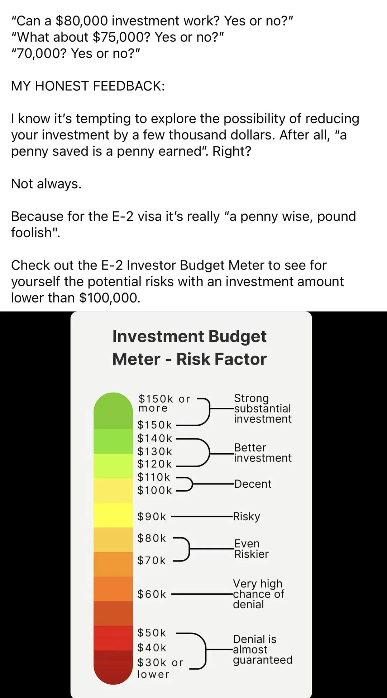

---

title: How to get E2 Visa as a Startup Founder
description: Scrappy guide for international founders using the E2 Investor Visa to launch in the US
tags:

* e2 visa
* international founders
* startup founders
* investor visa
* us immigration
* treaty countries

---

## 🔍 Overview

### 💡 About

The E2 Treaty Investor Visa is a fast-track for startup founders from treaty countries to live and build in the US. It’s lean, renewable, and perfect if you’ve got capital and control.

### ✅ Requirements

* You’re from an E2 treaty country [list](#list-of-e2-treaty-countries)
* You invest \~\$100K+ of your own money
* You own 50%+ of a US-based company

### 🎯 Benefits

* Fast approval (\~3 months)
* High success rate (91%+)
* Spouse can work anywhere in US
* Renewable indefinitely as long as startup stays legit

### 💸 Cost

Here’s a rough estimate of what the E2 journey will run you:

| Item | Cost Estimate | Notes |
| --- | --- | --- |
| Company setup | $1,500 | Delware C-Corp via [Clerky](https://www.clerky.com/) |
| Legal fees | $3,000–$8,000 | Optional but smart |
| Investment | $100,000+ | Must be your money, not investors |
| Visa fees | $205+ | Per applicant, consular fees vary |
| Admin costs | $500–$2,000 | Accounting, business address, etc |

👉 Total estimate: **$105K–$115K+**

### ⌚️ Timeline 

If you meet the requirements is shuold take around 3 months (will let you know how fast it took for me I'm starting process at 8th July 2025 but I already have company seted up) if you don't have a company set up this process will probably add 2-4 months before you will be able to apply for E-2 visa. 

PS: I wrote a guide on how to start a company in the US remotly [here](www.example.com) 

## 🛠 Step-by-Step Guide

1. **Form your US company**

   * Form C-Corp via [Clerky](https://www.clerky.com/) or [Stripe Atlas](https://stripe.com/atlas)
   * Open US bank account with [Mercury](https://mercury.com/) (best for internationl founders)
   * Build a business plan 

2. **Invest your own capital**

   * Spend on operations, not just savings
   * Track and document everything

3. **Prepare visa application**

   * Fill DS-160 + DS-156E
   * Gather documents: ownership, funds, business plan, invoices

4. **Attend visa interview**

   * Schedule with US consulate
   * Bring full docs + know your business cold

5. **Get approved and enter US**

   * Start running your business
   * Keep records for renewals

## 🧪 My Story

08 July 2025 - Still in Poland just starting the process. I'm writing this guide to organize informations in my head better :) At this stage a have my company formed as Delaware C-Corp and have no idea how to get E-2

## Tips

### Investment amount 
There is no legaly minimum required amount but I found this pic on reddit in this [discussion](https://www.reddit.com/r/e2visa/comments/1d28fi0/how_much_does_one_need_to_invest_for_e2_visa/)

## 📚 Resources

* [List of E2 Treaty Countries](https://travel.state.gov/content/travel/en/us-visas/visa-information-resources/fees/treaty.html)
* [DS-160 Form portal](https://ceac.state.gov/CEAC/)
* [DS-156E Form PDF](https://eforms.state.gov/Forms/ds156e.PDF)
* [I-129 Form](https://www.uscis.gov/i-129)
* [I-94 Portal](https://i94.cbp.dhs.gov/I94/#/home)
* [USCIS E-2 Guidance](https://www.uscis.gov/working-in-the-united-states/temporary-workers/e-2-treaty-investors)
* [US State Department E-2 Info](https://travel.state.gov/content/travel/en/us-visas/visa-information-resources/fees/treaty.html)
* [US Embassy/Consulate Directory](https://www.usembassy.gov/)
* [Department of Commerce](https://www.commerce.gov/)
* [Small Business Administration (SBA)](https://www.sba.gov/)
* [SCORE Mentoring](https://www.score.org/)
* [Mercury Bank](https://mercury.com/)
* [Clerky](https://www.clerky.com/)
* [Stripe Atlas](https://stripe.com/atlas)

#### List of E2 Treaty Countries

 📋 

- Albania (3 years)
- Argentina (5 years)
- Armenia (5 years)
- Australia (4 years)
- Austria (5 years)
- Azerbaijan (3 months)
- Bahrain (3 months)
- Bangladesh (3 months)
- Belgium (5 years)
- Bosnia and Herzegovina (1 year)
- Bulgaria (5 years)
- Cameroon (1 year)
- Canada (5 years)
- Chile (5 years)
- Colombia (5 years)
- Congo (Brazzaville) (3 months)
- Congo (Kinshasa) (3 months)
- Costa Rica (5 years)
- Croatia (5 years)
- Czech Republic (5 years)
- Denmark (5 years)
- Egypt (3 months)
- Estonia (5 years)
- Ethiopia (6 months)
- Finland (2 years)
- France (4 years)
- Germany (5 years)
- Grenada (5 years)
- Honduras (5 years)
- Iran (3 months)
- Ireland (5 years)
- Italy (5 years)
- Jamaica (5 years)
- Japan (5 years)
- Jordan (3 months)
- Kazakhstan (1 year)
- Kosovo (1 year)
- Kyrgyzstan (3 months)
- Latvia (5 years)
- Liberia (1 year)
- Lithuania (1 year)
- Luxembourg (5 years)
- Macedonia (5 years)
- Mexico (1 year)
- Moldova (3 months)
- Mongolia (3 years)
- Montenegro (1 year)
- Morocco (5 years)
- Netherlands (5 years)
- New Zealand (5 years)
- Norway (5 years)
- Oman (6 months)
- Pakistan (5 years)
- Panama (5 years)
- Paraguay (5 years)
- Philippines (5 years)
- Poland (1 year)
- Romania (5 years)
- Senegal (1 year)
- Serbia (1 year)
- Singapore (2 years)
- Slovak Republic (2 years)
- Slovenia (5 years)
- South Korea (5 years)
- Spain (5 years)
- Suriname (5 years)
- Sweden (2 years)
- Taiwan (5 years)
- Thailand (6 months)
- Tunisia (5 years)
- Turkey (5 years)
- Ukraine (3 months)
- United Kingdom (5 years)

 

*This isn’t legal advice. I have no idea what I'm talking about. Just sharing what I've read on the internet. Laws change. Talk to an expert before you jump.*
